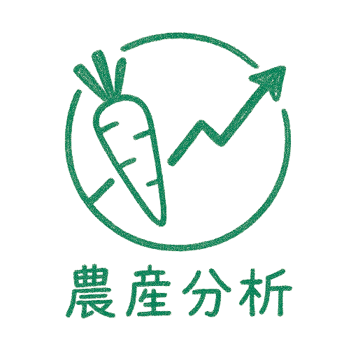
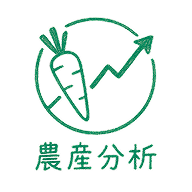

# 🥬 農產品交易資料分析系統 (Better Vegetable Catcher)

<div align="center">



**快速查詢與分析農產品價格趨勢，協助您做出更好的交易決策**

[](https://github.com/backup0821/Better-vegetable-catcher)
[](https://creativecommons.org/licenses/by-nc/4.0/)
[](https://backup0821.github.io/Better-vegetable-catcher/)
[](https://github.com/backup0821/Better-vegetable-catcher)</br>
[](https://github.com/backup0821/Better-vegetable-catcher)
[](https://github.com/backup0821/Better-vegetable-catcher)
[](https://github.com/backup0821/Better-vegetable-catcher)

</div>

---

## 📋 目錄

- [🎯 專案簡介](#-專案簡介)
- [✨ 主要功能](#-主要功能)
- [🖥️ 系統特色](#️-系統特色)
- [📱 多平台支援](#-多平台支援)
- [🚀 快速開始](#-快速開始)
- [📊 功能展示](#-功能展示)
- [🔧 技術架構](#-技術架構)
- [📈 資料來源](#-資料來源)
- [🤝 貢獻指南](#-貢獻指南)
- [📄 授權條款](#-授權條款)

---

## 🎯 專案簡介

**農產品交易資料分析系統** 是一個專為農產品交易者、農民和市場分析師設計的智慧化資料分析平台。透過整合農業部開放資料，提供即時價格查詢、趨勢分析、季節性預測等功能，幫助使用者做出更明智的交易決策。

<div align="center">



*直觀的應用程式圖標，一看 就能認出*

</div>

---

## ✨ 主要功能

### 📊 資料分析功能
- **價格趨勢分析** 📈 - 即時顯示農產品價格變化趨勢
- **交易量分布** 📊 - 分析不同時期的交易量分布情況
- **價格分布統計** 📉 - 統計價格區間分布，了解不同市場價格結構
- **季節性分析** 🌱 - 分析農產品的季節性價格變化模式 (因資料僅保留數天，無法實際查看各季資料，此功能正在優化)
- **價格預測** 🔮 - 基於近7天各市場價格的價格趨勢預測

### 🔔 智慧通知系統
- **價格異常通知** ⚠️ - 當價格出現異常波動時自動通知 (待確認)
- **市場休市提醒** 🏪 - 提醒市場休市時間
- **維護狀態通知** 🛠️ - 系統維護時的通知
- **重大維護通知** 📢 - 系統發生重大錯誤，導致無法正確使用的通知

### 📱 多平台體驗
- **響應式設計** 📱 - 完美適配手機、平板、電腦以及各個裝置
- **可安裝支援** 📲 - 可安裝為手機應用程式
- **離線也可用** 🔌 - 支援離線瀏覽和資料快取

---

## 🖥️ 系統特色

<div align="center">

| 特色 | 描述 | 圖示 |
|------|------|------|
| **即時資料** | 與農業部資料同步，提供最新市場資訊 | 🕒 |
| **智慧分析** | AI 驅動的資料分析，提供深度洞察(僅電腦版) | 🤖 |
| **多維度視覺化** | 豐富的圖表類型，直觀呈現資料 | 📊 |
| **個人化設定** | 可自訂介面主題 | ⚙️ |
| **高效能** | 優化的資料處理和快取機制 | ⚡ |
| **安全性** | 資料加密傳輸，保護使用者隱私，開源程式，沒有病毒 | 🔒 |
| **快速修復** | 系統發生錯誤，開發人員立即上線協助維護 | 🕙 |
</div>

---

## 📱 多平台支援

### 🌐 Web 版本
- 現代化瀏覽器支援
- 響應式設計，適配各種螢幕尺寸
- 豐富的互動功能

### 📱 PWA 應用
- 可安裝到手機桌面
- 離線功能支援
- 推送通知功能(待確認)

---

## 🚀 快速開始

### 1. 線上使用
直接訪問我們的網站：

https://backup0821.github.io/Better-vegetable-catcher/WEB


### 2. 本地部署
```bash
# 複製專案
git clone https://github.com/backup0821/Better-vegetable-catcher.git

# 進入專案目錄 (注意是 WEB 資料夾喔)
cd Better-vegetable-catcher/WEB

# 啟動本地伺服器
python -m http.server 8000
# 或使用 Node.js來啟用
npx serve .

# 開啟瀏覽器訪問
http://localhost:8000
```

### 3. PWA 安裝
1. 在手機瀏覽器中開啟網站
2. 點擊「安裝」或「新增到主畫面」
3. 享受原生應用程式般的體驗

---

## 📊 功能展示

### 主要分析介面
- **作物搜尋** 🔍 - 快速搜尋特定農產品
- **市場選擇** 🏪 - 選擇特定市場
- **圖表顯示** 📈 - 快速且清楚的查看資料
- **資料匯出** 📤 - 支援 CSV、Excel 格式匯出 (未完工)
- **新版介面** 🚧 - 尚未完工
---

## 🔧 技術架構

### 前端技術
- **HTML5** + **CSS3** + **JavaScript (ES6+)**
- **Plotly.js** - 互動式圖表繪製
- **PWA** - 漸進式網頁應用
- **Service Worker** - 離線功能支援

### 資料處理
- **IndexedDB** - 本地資料儲存
- **ETag** - 智慧快取機制
- **RESTful API** - 資料交換

### 部署平台
- **GitHub Pages** - 靜態網站託管
- **CDN** - 內容分發網路

---

## 📈 資料來源

本系統的資料來源於：
- **農業部資料開放平台** 🌾
- **農產品批發市場交易行情** 📊
- **農業氣象資訊** 🌤️

資料更新頻率：每日更新

---

## 🤝 貢獻指南

我們歡迎所有形式的貢獻！

### 如何貢獻
1. **Fork** 本專案
2. 建立您的功能分支 (`git checkout -b feature/AmazingFeature`)
3. 提交您的變更 (`git commit -m 'Add some AmazingFeature'`)
4. 推送到分支 (`git push origin feature/AmazingFeature`)
5. 開啟 **Pull Request**

### 貢獻類型
- 🐛 **Bug 回報** - 發現問題請開 Issue
- 💡 **功能建議** - 新功能想法歡迎討論
- 📝 **文件改進** - 幫助改善文件品質
- 🎨 **UI/UX 優化** - 改善使用者體驗
- 🍅 **其他** - 各種你想的到的想法
---

## 📄 授權條款

<div align="center">


</div>

本專案由@Yo-codeback(開發者)完工，利用@backup0821(開發團隊)發布，專案由開發者、開發團隊所有，其不受到任何授權條款限制，可自由分享、改作、散步、商業用途。

本專案採用 **Creative Commons Attribution-NonCommercial 4.0 International License** (CC BY-NC 4.0) 授權條款。

### 授權內容
- ✅ **允許**：分享、改作、散布
- ✅ **要求**：標示原作者姓名
- ❎ **禁止**：商業用途

### 完整授權條款
詳細授權內容請參閱：[CC BY-NC 4.0 授權條款](https://creativecommons.org/licenses/by-nc/4.0/)

---

## 📞 聯絡資訊

- **專案維護者**：鹿中創客、@Yo-codeback
- **GitHub**：[backup0821](https://github.com/backup0821)
- **GitHub**：[Yo-codeback](https://github.com/Yo-codeback)
- **Email**：makerbackup0821@gmail.com
- **專案網址**：[Better-vegetable-catcher](https://github.com/backup0821/Better-vegetable-catcher)

---

<div align="center">

**🌟 感謝您使用農產品交易資料分析系統！**

*讓我們一起為台灣農業的數位化發展努力！* 🌾

</div>